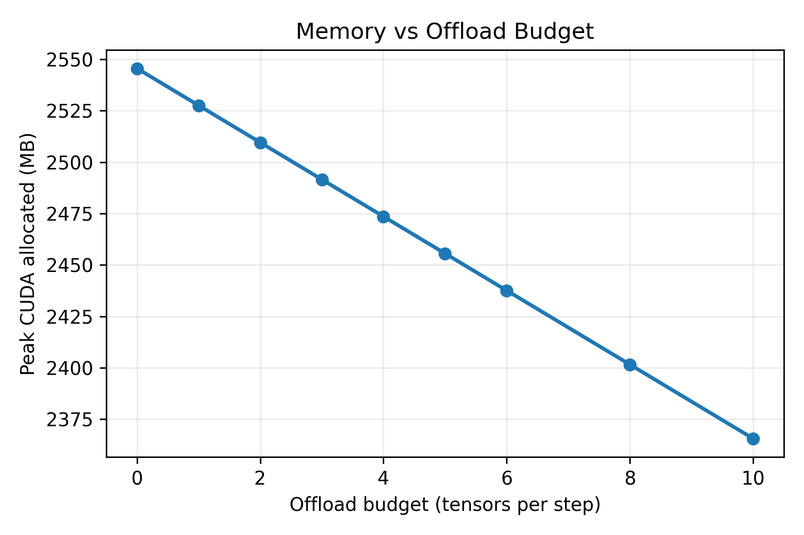
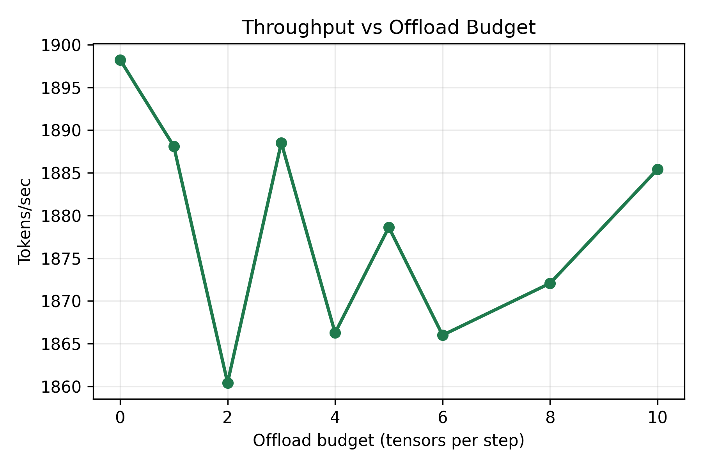
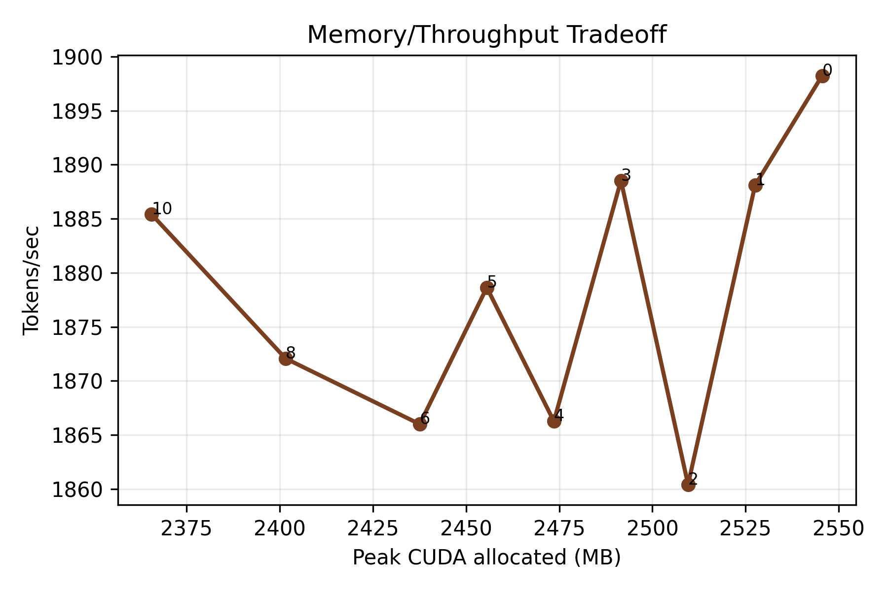
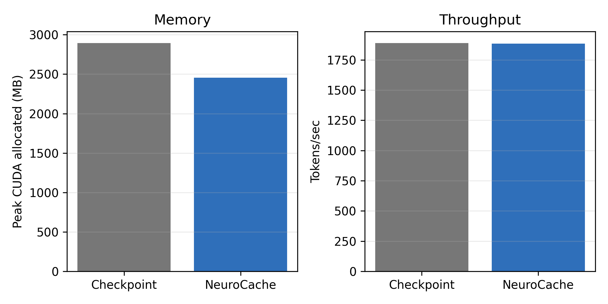

# NeuroCache

Research Paper:- https://www.researchgate.net/publication/404466007_NeuroCache_Budget-Constrained_Activation_Offloading_for_Low-VRAM_Transformer_Training

Real CUDA validation of budgeted activation offloading for transformer training
on low-VRAM NVIDIA GPUs.

NeuroCache uses PyTorch `saved_tensors_hooks` to move a small, fixed budget of
large autograd-saved activations from GPU memory to pinned CPU memory during
training. The current validated configuration combines:

- Transformer block gradient checkpointing.
- Budgeted activation offload with `k=5` tensors per step.
- BF16 Adam optimizer moments stored on CUDA.
- Real RTX 2050 CUDA measurements, not simulated placement results.

## Validated RTX 2050 Result

Hardware:

- GPU: NVIDIA GeForce RTX 2050, 4096 MiB reported by `nvidia-smi`
- Driver: 577.05
- PyTorch: 2.11.0+cu128
- CUDA runtime in PyTorch: 12.8
- Model: 97.93M-parameter GPT-like decoder
- Sequence length: 768
- Batch size: 8

Five-seed, 10-step validation:

| Variant | Peak CUDA MB | Tokens/sec | Memory vs checkpoint | Throughput vs checkpoint |
|---|---:|---:|---:|---:|
| Gradient checkpointing | 2895.8 | 1890.0 | 0.0% | 0.0% |
| Checkpoint + BF16 Adam state | 2545.6 | 1891.8 | 12.1% | +0.1% |
| NeuroCache budget-5 | 2455.6 | 1885.0 | 15.2% | -0.3% |

Longer 20-step locked repeat:

| Variant | Peak CUDA MB | Tokens/sec | Memory vs checkpoint | Throughput vs checkpoint |
|---|---:|---:|---:|---:|
| Gradient checkpointing | 2894.5 | 1890.2 | 0.0% | 0.0% |
| NeuroCache budget-5 | 2456.4 | 1887.6 | 15.1% | -0.1% |

**Honest claim:** NeuroCache achieves about 15.1-15.2% lower peak CUDA memory
than gradient checkpointing with near-equal checkpoint-level throughput on RTX
2050. The strict mean throughput win is not yet proven for the locked budget-5
configuration.

DeepSpeed is not claimed here because it has not yet been measured in this
Windows RTX 2050 environment.

## Result Plots









## Repository Layout

```text
neurocache/
  activation_cache.py          Real saved-tensor activation offload runtime
  predictor.py                 LSTM predictor model used in exploratory work
  quantization.py              Quantization helpers
experiments/
  rtx2050_real_benchmark.py    Single-run real CUDA benchmark harness
  validate_neurocache_rtx2050.py
                               Publication validation suite
  train_balanced_predictor.py  Balanced predictor training utility
docs/
  REAL_BENCHMARKS.md           How to reproduce the real benchmark suite
  RTX2050_RESULTS.md           Interpreted RTX 2050 results
results/validation/
  rtx2050_publication/         CSV/JSON validation data, plots, paper draft
  rtx2050_publication_20step/  Longer locked-configuration repeat
```

## Install

Create a virtual environment, then install dependencies:

```powershell
python -m venv .venv
.venv\Scripts\python.exe -m pip install -r requirements.txt
```

For RTX 2050 validation, install a CUDA-enabled PyTorch build compatible with
your driver. The recorded validation used PyTorch `2.11.0+cu128`.

## Reproduce The Main Validation

Run the publication suite:

```powershell
.venv\Scripts\python.exe experiments\validate_neurocache_rtx2050.py --steps 10 --output-dir results\validation\rtx2050_publication
```

Regenerate tables and figures from already-recorded raw data:

```powershell
.venv\Scripts\python.exe experiments\validate_neurocache_rtx2050.py --steps 10 --output-dir results\validation\rtx2050_publication --postprocess-only
```

Run the single benchmark directly:

```powershell
.venv\Scripts\python.exe experiments\rtx2050_real_benchmark.py --warmup-steps 1 --measure-steps 20 --d-model 768 --n-layers 12 --n-heads 12 --seq-len 768 --batch-size 8 --min-tensor-kb 4096 --variants checkpoint,neurocache_budget5_checkpoint_cpu_bf16adam
```

## Validation Artifacts

Committed artifacts for verification:

- `results/validation/rtx2050_publication/raw_runs.csv`
- `results/validation/rtx2050_publication/raw_runs.json`
- `results/validation/rtx2050_publication/main_result_table.csv`
- `results/validation/rtx2050_publication/multi_seed_stats.csv`
- `results/validation/rtx2050_publication/budget_sweep_table.csv`
- `results/validation/rtx2050_publication/plots/*.png`
- `results/validation/rtx2050_publication/plots/*.svg`
- `results/validation/rtx2050_publication/PAPER_RESULTS_DRAFT.md`
- `results/validation/rtx2050_publication_20step/locked_20step_summary.csv`
- `results/validation/rtx2050_publication_20step/locked_20step_summary.json`

## Caveats

- The benchmark uses deterministic random token batches to isolate systems
  behavior from dataset download, tokenization, and model hub availability.
- BF16 optimizer moments are not bit-identical to FP32 AdamW state.
- Longer convergence experiments are still required before making model-quality
  claims.
- Earlier exploratory files may discuss predictor and async ideas, but the
  publication-grade result in this repository is the locked budget-5 validation.

## License

This project is licensed under the Creative Commons Attribution 4.0
International License. See [LICENSE](LICENSE).

## Author

Aayush Kumar

- GitHub: [@ABL4Z3](https://github.com/ABL4Z3)
